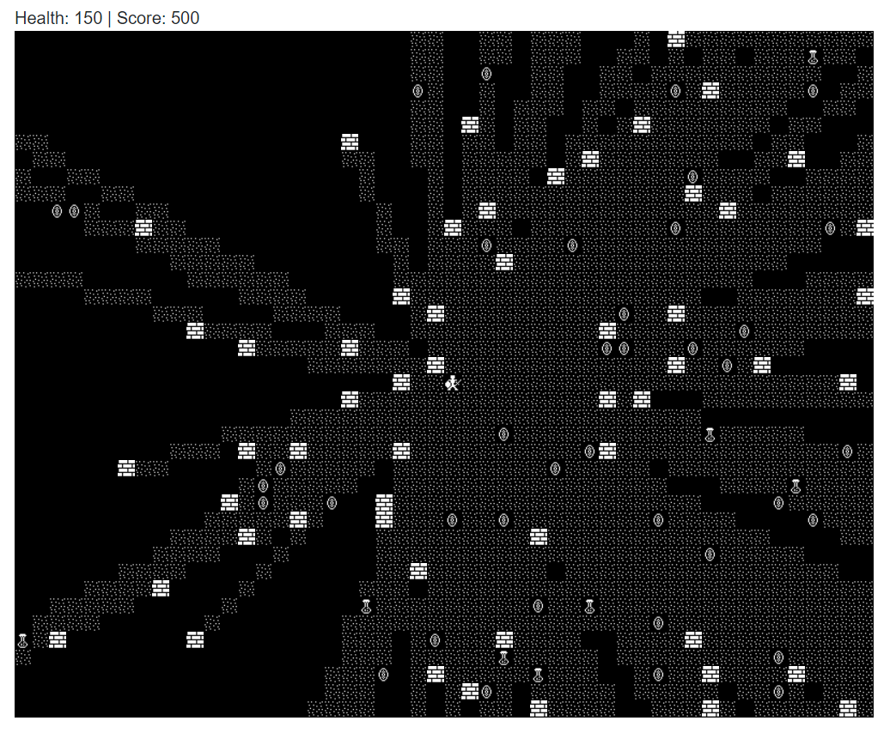

# BlazorRogueLike

This is a crazy idea where the game field is rendered using DIVs instead of
something performant like a Canvas or WebGL. This is totally crazy and it's
working!

Things are being kept simple right now versus elegant as I work through various
aspects of creating roguelikes. As I figure out various aspects the code will
be written better. Things are a little ugly rightn now. LOL!

## Videos

## Author

Frank Hale &lt;frankhaledevelops@gmail.com&gt;

9 Feb 2021

## License

MIT